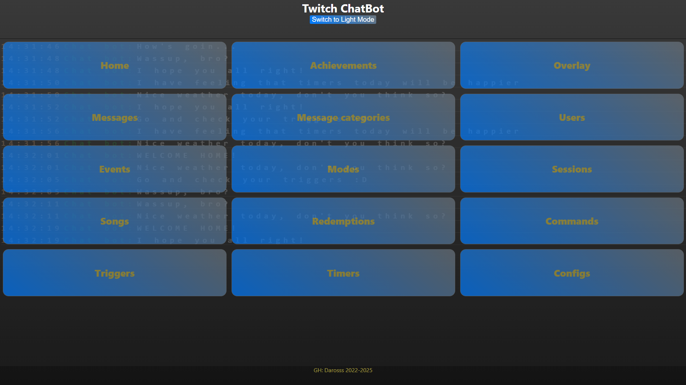
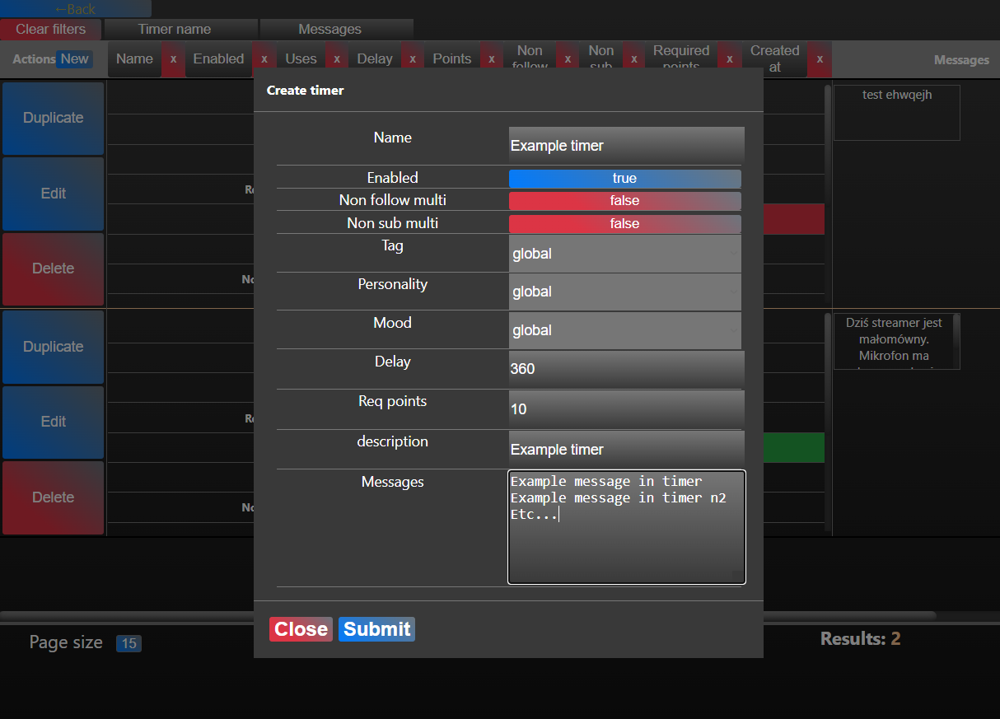
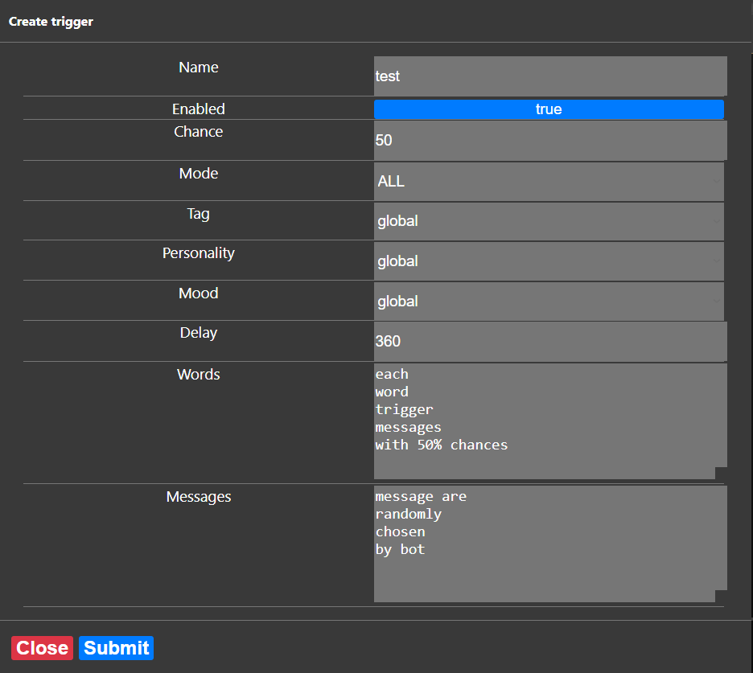
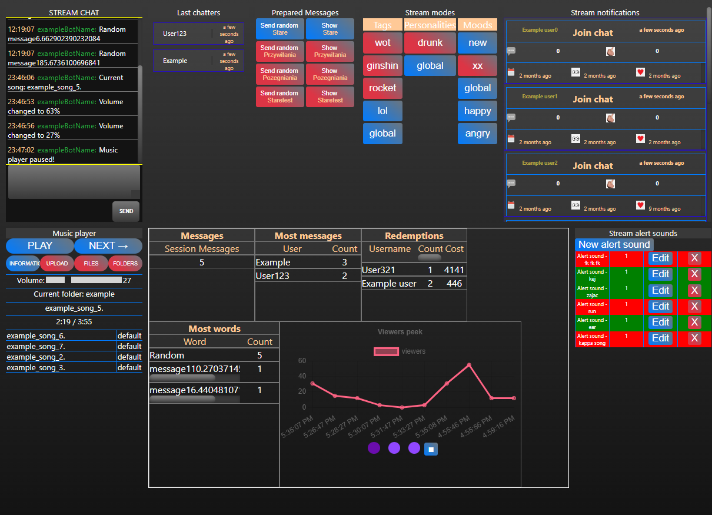
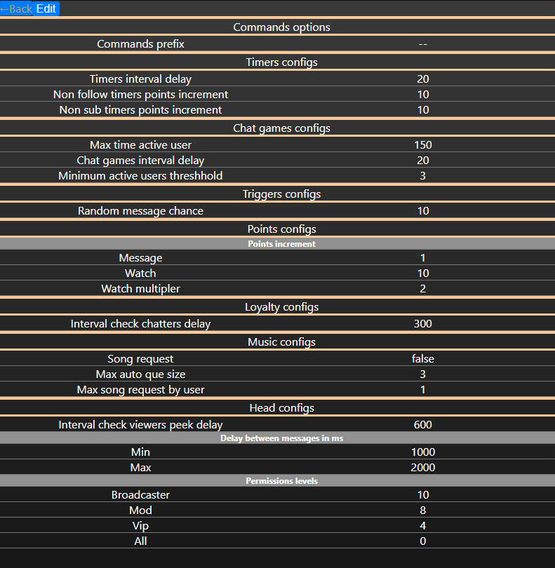

# Twitch ChatBot

<a name="readme-top"></a>

**⚠️ Note: This repository is currently under development and is not yet production-ready. Use at your own risk.**

<details>
  <summary>Table of Contents</summary>
  <ol>
    <li>
      <a href="#about-the-project">Twitch ChatBot</a>
      <ul>
        <li><a href="#built-with">Built With</a></li>
      </ul>
    </li>
    <li>
      <a href="#getting-started">Getting Started</a>
      <ul>
        <li><a href="#prerequisites">Prerequisites</a></li>
        <li><a href="#installation">Installation</a></li>
        <li><a href="#configuration">Configuration</a></li>
    <li><a href="#how-to-start">How to start</a></li>
      </ul>
    </li>
    <li><a href="#features">Features</a></li>
    <li><a href="#usage">Usage</a></li>
    <li><a href="#roadmap">Roadmap</a></li>
    <li><a href="#license">License</a></li>
    <li><a href="#contact">Contact</a></li>
  </ol>
</details>
<br>



Twitch chat bot designed to be deployed on localhost and home LAN only.
It **SHOULD NOT** be on online hosting.

## Built with

- React.js
- Express.js
- MongoDB
- Socket.IO
- twurple
- moment
- tmi.js
- winston
- multer
- React grid layout

## Getting started

<p align="right">(<a href="#readme-top">back to top</a>)</p>

### Prerequisites

To use this you need to have:

- MongoDB(`v6.0.4^`) Community Server installed and running on your local machine - `<https://www.mongodb.com/try/download/community>

- NodeJS(`v18.14.0^`)
- npm

```sh
  npm install npm@latest -g
```

### Installation

1. Clone the repo

```sh
git clone https://github.com/Darosss/TwitchChatBot.git
```

2. From root folder navigate to `server` folder and install npm packages

```sh
  cd server
  npm install
```

3. From root folder navigate to `frontend` folder and install npm packages

```sh
cd frontend
npm install
```

### Configuration

The app requires several environment variables to be set in the `.env `file. You can use the `.env.example` _(should be in root directory)_ file as a template:  
_⚠️ Important Note: Please keep your environment variables secure and private! Do not commit them to version control, and do not share them publicly. Be sure to add your environment variables to a .env file in the root directory of your project, and add that file to your .gitignore file. If you are unsure about how to do this, please refer to the .env.example file in the root directory of this project._

```sh
# .env.example

# Server configuration
BACKEND_PORT=5000
DATABASE_CONNECT_URL=mongodb://127.0.0.1:27017/mychatbot

# Twitch application configuration

# Read below for CLIENT_ID / CLIENT_SECRET / REDIRECT_URL
CLIENT_ID=<twitch application client id>
CLIENT_SECRET=<twitch application client secret>

# Read below for YOUTUBE_API_KEY_V3
YOUTUBE_API_KEY_V3=keyapi

# ENCRYPTION_KEY - have to be 16 bytes string
# I've used crypto libaray: crypto.randomBytes(16).toString('hex')
ENCRYPTION_KEY=random_encryption_secret_stringkey

# REDIRECT_URL=<backend localhost with port>/auth/twitch/callback
REDIRECT_URL=http://localhost:5000/auth/twitch/callback

# This is for cors origin options
LOCAL_FRONTEND_URL=http://localhost:5173
HOST_FRONTEND_URL=http://192.168.0.100:5173

# Read below for BOT_PASSWORD / BOT_USERNAME / BOT_ID
BOT_PASSWORD=oauth:1234567890
BOT_USERNAME=botusername
BOT_ID=123456789

# Must be same as backend localhost:port if app isn't hosted or ip:port if app is hosted through LAN network
VITE_BACKEND_URL=http://192.168.0.100:5000
```

<sub> `CLIENT_ID` and `CLIENT_SECRET` - both can be obtained from twitch apllication: Read it here: <https://dev.twitch.tv/docs/authentication/register-app/> <br>
`YOUTUBE_API_KEY_V3` - info: https://developers.google.com/youtube/v3/getting-started
<br>
`OAuth Redirect URLs` - in twitch app should have \<backend localhost with port>/auth/twitch/callback
<br>
`REDIRECT_URL` - must be same as **OAuth Redirect URLs** from app registered above <br>
`BOT_PASSWORD` - can be obtained by accesing Implicit grant flow. More information: https://dev.twitch.tv/docs/authentication/getting-tokens-oauth/#implicit-grant-flow<br>
`BOT_ID` - can be obtained from twitch api or any external site
</sub>

### How to start

#### Start server

- navigate to server folder
  ```sh
    cd server
  ```
- then build

  ```sh
    npm build
  ```

- then run

  ```sh
    node ./dist/index.js
  ```

- OR you can too use nodemon as it will build and start server

  ```sh
    npm run dev
  ```

#### Start frontend

- navigate to frontend folder

  ```sh
    cd frontend
  ```

- navigate to frontend folder

  ```sh
    npm start
  ```

## Usage

<p align="right">(<a href="#readme-top">back to top</a>)</p>

Once the app is started, it will listen for incoming twitch chat messages on your local machine and respond accordingly.

## Features

#### The chatbot includes the following features:

- Modes:

  - Available modes are: Tags / Moods / Affixes
  - Create modes and assign them to timers / triggers / commands / message categories
  - By default global modes are created
  - Depends on which Tags and/or Moods are currently turned on, bot sends other messages(_of course if you added any_)
  - Affixes are a bit different, just because they works as affix to messages. Each of affixes have multipler(in %) that adjust global configs of affix chance

- Timers:

  - Schedule messages to be sent at regular intervals
  - And/or depends on points per message.
  - Two options per timers when non sub(_option is visible but not yet implemented_) or non follow write on chat it adds points depends on values in config
  - <details>
      <summary>Show images</summary>
      
      </details>

- Triggers:

  - Messages that triggers depends on context that user says
  - Each trigger canhave mode between: ALL / WHOLE-WORD / STARTS-WITH

    - **STARTS-WITH**: trigger only fire when any word/message starts with word
    - **WHOLE-WORD**: trigger only fire when whole word occurs
    - **ALL**: trigger fire wherever word occurs

  - triggers can have chance(_depends on % in configs_) when no trigger is found, that bot will send any random message from enabled message category

  - <details>
      <summary>Show images</summary>
      
      </details>

- Message categories:

  - These are used in message box and random messages when no triggers found
  - Simply they contain name of category and messages list

- Event subscriptions:

  - Subscribe to event on Twitch, such as when a user receive rewards and starts stream session when you start streaming.

- Chat commands:

  - Define custom commands that users can trigger in chat.
  - Static commands for music player and song request:

    - <details>
      <summary>Show commands for <b>mod</b> permission</summary>

      - skip
      - pause
      - resume / play
      - stop
      - load `<folder name>` - loads music from folder

      </details>

    - <details>
      <summary>Show commands for <b>all</b> permission</summary>

      - next - say next song
      - previous - say previous song
      - when - say when requested song will be played
      - sr `<song name>` - request song

      </details>

  - Chat commands can contain user data who triggered command with `$user{<user field>}` fe.
    - `@$user{username}`, your messages: `$user{messageCount}`
  - And this command data with `$command{<command field>}` fe.
    - I'm command and my name is: `$command{name}`

- Chat logging:

  - Log all messages from the chat to database.

- Loyalty system:

  - Count watch time depends on visible chatters
  - Points system with multipler
  - Points per message
  - Points per watch session x multipler

- Overlay:

  - Channel points reward popup
  - Music player current song progress and current que

- Widgets / events which contain:

  All of widgets can be shown, hidden, resized and saved depending on requirements

  - Stream chat: Where you see messages and can send your custom messages as bot account
  - Last chatters: Show last active users on chat
  - Prepared messages window: Here are messages from Message categories list.
  - Modes: Here you can turn on/off modes (_modes are described above_)
  - Stream notification: Check whether someone joined or left the chat
  - Music player control: Control music from overlay in one window, upload and delete music/folders(_all music will be uploaded to `directory/dist/public` folder_)
  - Last or active stream session statistics
  - List of alert sounds as custom rewards
  - <details>
      <summary>Show images</summary>
      
      </details>

- Most options are configurable

  - <details>
      <summary>Show images</summary>
      
      </details>

- Widgets / events and overlay rely on react grid layout, so you can adjust windows on your needs

## Roadmap

- [] Add subscriptions to follows, subs, cheers and others
- [] Add styles for overlay and events widgets
- [] Add music from youtube to overlay
- [] Add info about music to database
- [] Add complete user edit
- [] Add functionality to non sub timers
- [] Refactor prefixes, sufixes to get from enabled modes
- [] Add information about fields in frontend when:
  - [] Creating new triggers, chat commands, timers or message categories
  - [] Editing configs to understand what each config option does
- [] Add rest of alert sounds options (fe. enabled, colors, prompts etc.)
- [] Add more stream statistics and improve existing
- [] Add variety chat games (fe. random numbers, jokes etc)
- [] Add starting soon and ending screens as overlays

## License

<p align="right">(<a href="#readme-top">back to top</a>)</p>

Distributed under the MIT License. See `LICENSE.md` for more information.

## Contact

<p align="right">(<a href="#readme-top">back to top</a>)</p>

Darosss - daroinf12@gmail.com

Project Link: [https://github.com/Darosss/TwitchChatBot](https://github.com/Darosss/TwitchChatBot)
